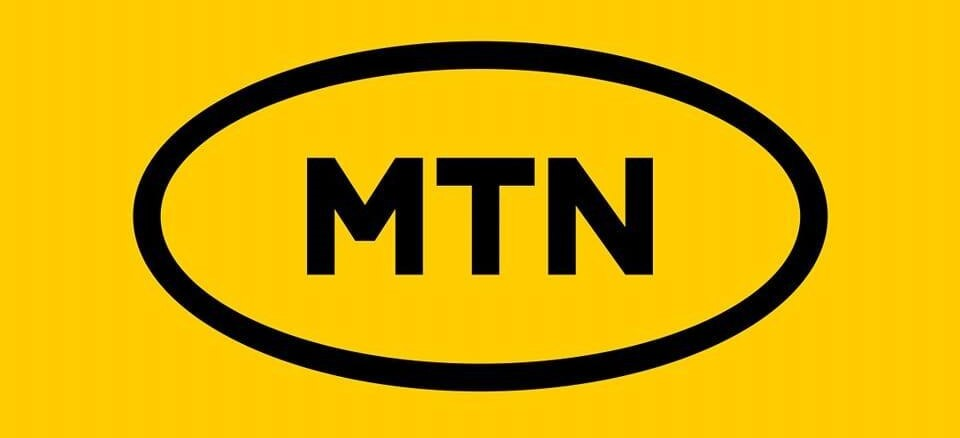

# MTN Churn Prediction


## 📌 Overview

This project aims to predict customer churn in Nigeria’s telecom industry using the MTN dataset. By leveraging machine learning, we analyze customer demographics, service usage, and behavioral data to identify churn risks and provide actionable insights.

## 📂 Dataset



- Source: [MTN Nigeria Churn Dataset (Kaggle)](https://www.kaggle.com/datasets/oluwademiladeadeniyi/mtn-nigeria-customer-churn)
- Size: 974 records, 17 features
- Features include: demographics, device usage, subscription plans, revenue, churn status
- Challenges: imbalanced classes, categorical + numerical data

## 🔎 Methodology
1. Data Preprocessing
    - Handle missing values, duplicates, and inconsistent labels
    - Encode categorical variables and scale numerical features
2. Exploratory Data Analysis (EDA)
    - Churn distribution by demographics and service usage
    - Correlation analysis and key churn drivers
3. Feature Engineering
    - Derived features (e.g., revenue per month, usage intensity)
    - One-hot encoding and feature scaling
4. Modeling
    - Algorithms: Logistic Regression, SVM, Random Forest, XGBoost/LightGBM
    - Metrics: Accuracy, Precision, Recall, F1-score, ROC-AUC
    - Class imbalance handled via SMOTE/class weighting
    - Hyperparameter tuning with cross-validation
5. Deployment
    - Streamlit web app with:
      - Dashboard: EDA insights and visualizations
      - Prediction Tool: Input customer data to get churn risk prediction

## 🚀 Usage
1. Clone the repo:
   ```bash
   git clone https://github.com/<username>/mtn-churn-prediction.git
   cd mtn-churn-prediction
   ```
2. Install dependencies:
   ```bash
   pip install -r requirements.txt
   ```
3. Run Jupyter notebooks for EDA and modeling:
   ```bash
   jupyter notebook
   ```
4. Launch the Streamlit app:
   ```bash
   streamlit run app.py
   ```

## 🌐 Deployment
  - Hosted on Streamlit Community Cloud
  - Access the live app: [App Link]()

## 📊 Expected Outcomes
  - Predictive ML model for churn detection
  - Insights into major churn drivers
  - Interactive tool for analysts and managers

## 👥 Team Members
  - Izundu Dan-Ekeh
  - Daud Abolade
  - Edeh Ndubuisi Michael
  - Ekaette Samuel
  - Akanbi Abiodun Olawale
